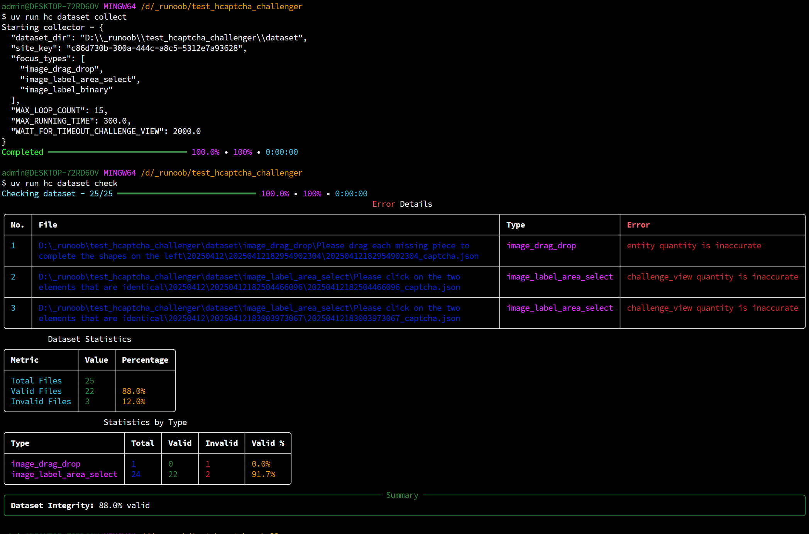
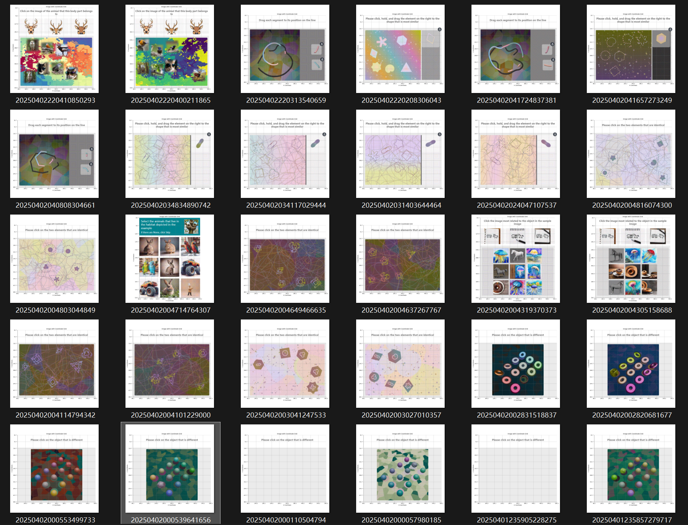

# 文档

## 快速入门

### 简介

hCaptcha Challenger (v0.13.0+) 借助大语言模型的 **Spatial Chain-of-Thought (SCOT)** 能力构建了一套端到端的 Agentic Workflow，使得 Agent 可遵循指令完成空间视觉通用任务，而无需额外训练或微调 CNN 专家模型。

在 hCaptcha Challenger 中，**Agent** 通过 Playwright 控制浏览器页面。在您的任务流程中，Agent 通过传入的 `Page` 对象初始化，并借用该对象接管当前页面的交互。您可以通过 Agent 实现 `click_checkbox`（点击验证框）和 `wait_for_challenge`（等待人机挑战）两个独立操作。

hCaptcha 是最早将图片扩散与合成技术应用于 CAPTCHA 领域的先驱之一。借助自动化工程领域的快速发展，hCaptcha 能够实现极为频繁的挑战类型更替。这导致过去两年中，社区在应对频繁更新的人机挑战时面临了越来越大的困难。传统的卷积神经网络（CNN）在目标检测任务中，对于小规模数据集难以实现良好的泛化效果，完整的模型微调过程需要投入大量的时间与精力，通常需要长达半周才能训练出适用于生产环境的 CNN 模型。然而，当模型训练完成之际，hCaptcha 可能已经更新了新的挑战类型，导致刚训练完成的模型迅速过时或失效。

因此，社区迫切需要一种强大的通用视觉解决方案，以有效应对空间视觉类的通用挑战。不论 hCaptcha 如何频繁更新验证类型，该方案均可快速适应环境变化，并能在无人引导的情况下自主控制浏览器完成各种人机验证任务。

### 安装

```bash
uv pip install hcaptcha-challenger
```

### 快速体验

如下是一个 hCaptcha 自动化验证案例，展示了如何通过 Agent 的 `robotic_arm`（机械臂接口）与网页验证元素进行交互。

特别说明：Agent 仅通过 `Page` 对象操控网页，因此可运行在任何基于 Playwright 构建的 "patcher" 之上。换言之，只要 Playwright 能启动的浏览器，均可通过此方式运行 Agent。

在如下案例中，你需要创建并设置 [GEMINI_API_KEY](https://aistudio.google.com/apikey)：

```python
import asyncio
import json

from playwright.async_api import async_playwright, Page

from hcaptcha_challenger.agent import AgentV, AgentConfig
from hcaptcha_challenger.models import CaptchaResponse
from hcaptcha_challenger.utils import SiteKey


async def challenge(page: Page) -> AgentV:
    """Automates the process of solving an hCaptcha challenge."""
    # Initialize the agent configuration with API key (from parameters or environment)
    agent_config = AgentConfig()

    # Create an agent instance with the page and configuration
    # AgentV appears to be a specialized agent for visual challenges
    agent = AgentV(page=page, agent_config=agent_config)

    # Click the hCaptcha checkbox to initiate the challenge
    # The robotic_arm is an abstraction for performing UI interactions
    await agent.robotic_arm.click_checkbox()

    # Wait for the challenge to appear and be ready for solving
    # This may involve waiting for images to load or instructions to appear
    await agent.wait_for_challenge()

    # Note: The code ends here, suggesting this is part of a larger solution
    # that would continue with challenge solving steps after this point
    return agent


async def main():
    async with async_playwright() as p:
        browser = await p.chromium.launch(headless=False)
        context = await browser.new_context()

        # Create a new page in the provided browser context
        page = await context.new_page()

        # Navigate to the hCaptcha test page using a predefined site key
        # SiteKey.user_easy likely refers to a test/demo hCaptcha with lower difficulty
        # await page.goto(SiteKey.as_site_link(SiteKey.discord))
        await page.goto(SiteKey.as_site_link(SiteKey.user_easy))

        # --- When you encounter hCaptcha in your workflow ---
        agent = await challenge(page)
        if agent.cr_list:
            cr: CaptchaResponse = agent.cr_list[-1]
            print(json.dumps(cr.model_dump(by_alias=True), indent=2, ensure_ascii=False))


if __name__ == "__main__":
    asyncio.run(main())

```

## 采集数据集

如果你有自己的 solver，也可以借助 `hcaptcha-challenger` 来管理图片数据集：

```bash
uv venv
uv pip install -U hcaptcha-challenger
uv run hc dataset collect
```



## 精彩瞬间



### Image Label Binary

https://github.com/user-attachments/assets/c2cea4e0-82f4-466f-8c7a-20f8ea63732c

### Image Label Area Select

https://github.com/user-attachments/assets/42ce8b1d-bb17-4397-b7b0-a9f9578b740a

### Image Drag Drop

https://github.com/user-attachments/assets/c7720d20-ddb4-45e5-8008-e4c8f2de316d