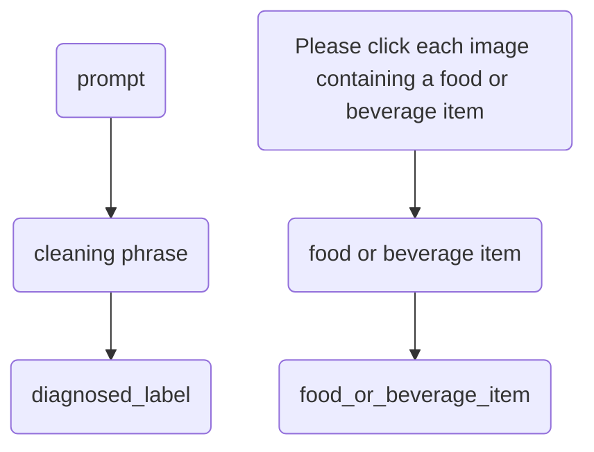

## 編排合法的模型名

```mermaid
graph TD;
	p(prompt)-->pl(cleaning phrase);
	pl-->dpl(diagnosed_label);
	
	ep(Please click each image containing a food or beverage item)
	epl(food or beverage item)
	edpl(food_or_beverage_item)
	ep-->epl-->edpl;
```