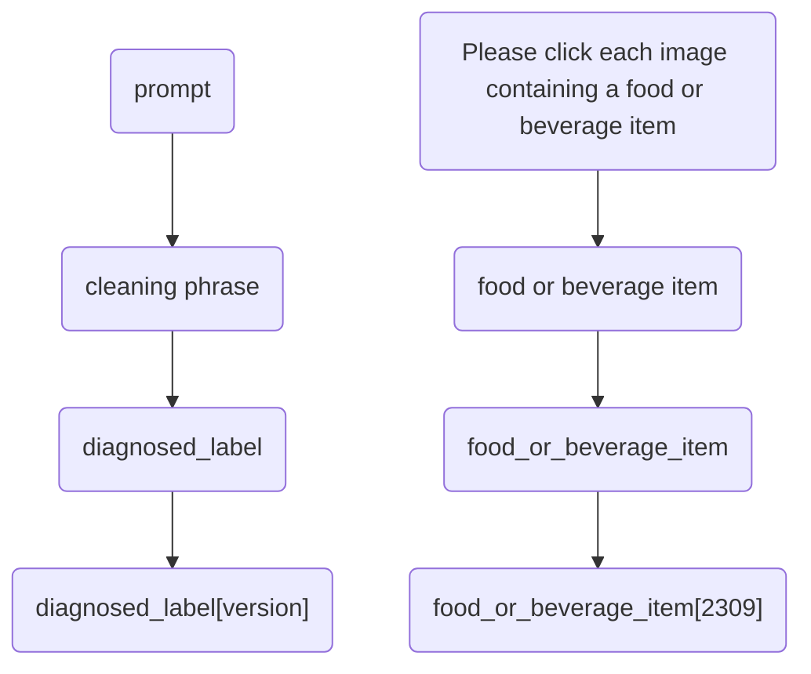
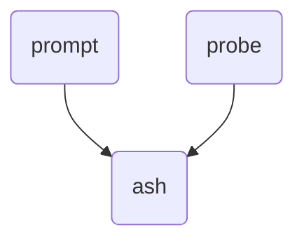
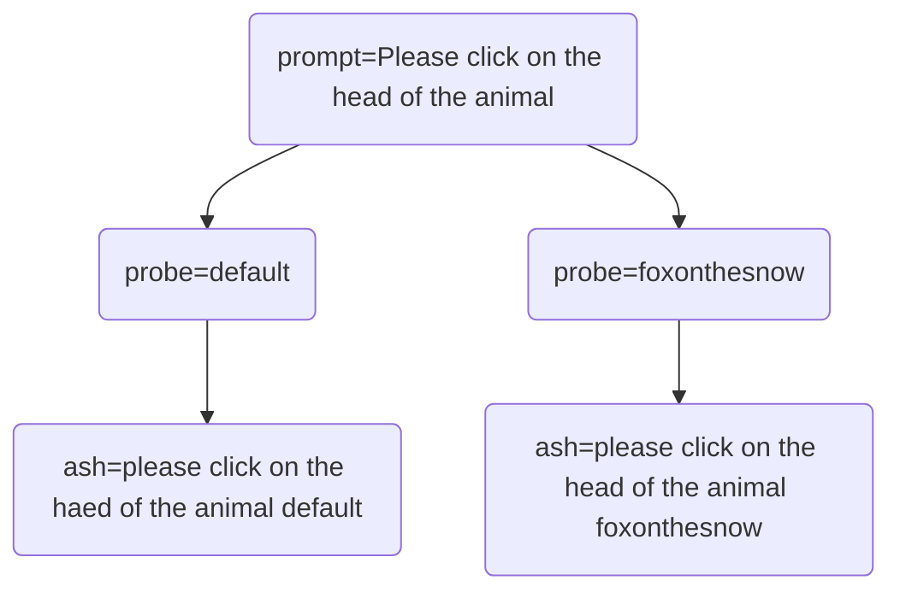
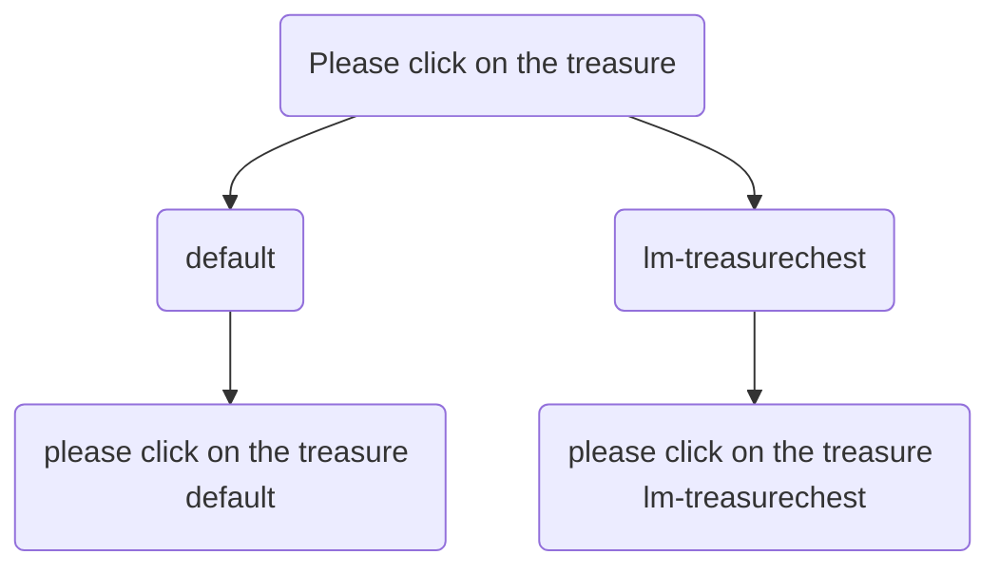

## 編排合法的模型名 Binary Challenge 

### 如何生成模型名？



### 如何編排 ResNet 模型名

```yaml
# Template
diagnosed_label[version]:
  zh: ["用中文表达的被清洗过的短语或单词"]
  en: ["cleaning phrase in English"]
# Examples
food_or_beverage_item2309:
  zh: ["食物或饮料"]
  en: ["food or beverage item"]
```

## 編排合法的模型名 Area Select Challenge 

### 如何决定模型名？







### 如何编排 YOLOv8 模型名

1. Strict mode

```yaml
# Template: probe != default
"<ANY><version>_yolov8<n|s|m>": ["<label1>", "<label2>"]

# 1. Example: `head of animal`
# label 必须以 `-head` 结尾，`-head` 之前的字符串必须是 probe 的一部分

# please click on the head of the animal hummingbirdonaflowerfield
animalhead2312_yolov8s.onnx: [ "hummingbird-head" ]

# please click on the head of the animal llamaonagarden
animalhead2311_yolov8s.onnx: [ "llama-head" ]

# please click on the head of the animal koalaonaeucalyptustree
# please click on the head of the animal owlonatree
animalhead2310_yolov8s.onnx: [ "koala-head", "owl-head" ]
```

2. Default Mode

```yaml
# Template: probe == default
"<part_of_ash>_<version>_yolov8<n|s|m>": ["<Any or part_of_ash>"]

# 1. Example: `can be eaten`
# model name 必须以下划线 `_` 分割单词，从前至后依次是：
# - `ash 的一部分`：也即 ' '.join(split("_")) 之后得到的字符串是 ash 的一部分 
# - `模型版本号`：默认以 2309 开始，每迭代一个版本数字 + 1
# - `YOLOv8基准模型版本`：通常是 n s m 规格

# please click on the thumbnail of something that can be eaten default
can_be_eaten_2309_yolov8s: ["x-eaten"]
```

